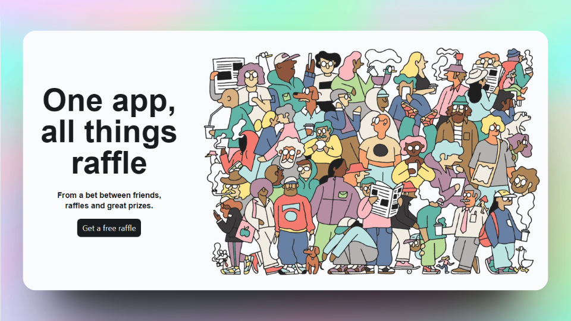

    <a href="https://sorteo-de-ideas.vercel.app/" target="_blank">
        Website
    </a>
    &nbsp;⁘&nbsp;
    <a href="#-stack">
        Stack
    </a>
    &nbsp;⁘&nbsp;
    <a href="https://twitter.com/jeremyjsx" target="_blank">
        Twitter
    </a>

## ⚙ Stack

- [**Vite**](https://vitejs.dev/) - Get ready for a development environment that can finally catch up with you.
- [**React 18**](https://react.dev/) - The library for web and native user interfaces.
- [**Tailwind CSS**](https://tailwindcss.com/) - A utility-first CSS framework for rapidly building custom designs.

## ☁ Deploy

We're using [**Vercel**](https://vercel.com/) for deployment:

- [**sorteo-de-ideas.vercel.app**](sorteo-de-ideas.vercel.app).
